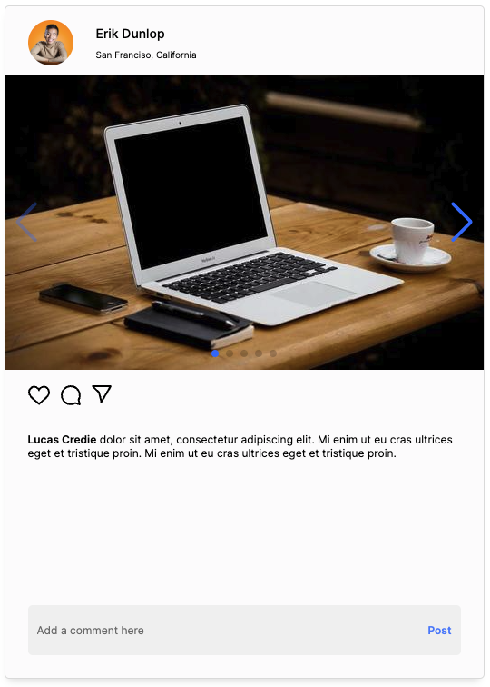
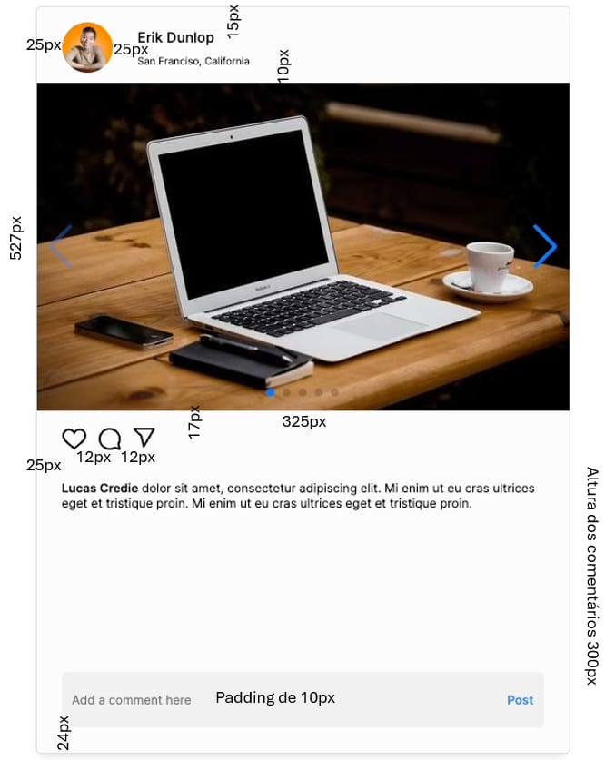

# Styled-components Digital Plus - Bruno Alves

## Para inicializar o projeto siga os passos a seguir
### 1 - Clone este repositório
### 2 - Instale as dependências do projeto com `npm install`
### 3 - Para rodar o projeto use o comando `npm run dev`

## A aplicação deve seguir o seguinte layout:

